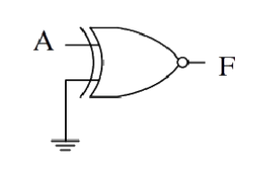

## Post test
#### Please attempt the following questions

  

Q1. A positive AND gate is also a negative  

A  NAND gate  
B  NOR gate  
C  AND gate  
<b>D  OR gate</b>  
 

Q2. The Boolean expression for two input NAND gate  

<b>A  (A.B)'</b>  
B  (A+B)'  
C  A'.B'  
D  A+B  
 

Q3. For multi-input AND gate, the unused input pins should not be left\_\_\_\_\_.  

A  On  
B  Connected  
<b>C  Unconnected</b>  
D  None of the above  
 

  
Q4. A NOT gate IC 7404 contains \_\_\_\_\_\_ NOT gates.  

A  3  
B  4  
<b>C  6</b>  
D  2  
 

 
Q5. What is the logic status at A and B to activate the alarm in fire alarm system where A represents temperature sensor while B represents smoke sensor  

A  A=1,B=0  
B  A=0,B=1  
C  A=1,B=1  
<b>D  All of the above</b>  
 

Q6. A fire alarm system can be implemented using  

A  Basic logic gates  
B  Op-Amp comparator  
C  555 timer IC  
<b>D  All of the above</b>  
 

 
Q7. The Boolean expression in term of A, B and C to activate the buzzer in burglar alarm system where A represents arm key switch, B represents Reed switch and C represents pressure mat, is  

A  A'.B.C  
B  A.B.C  
C  A.(B+C)  
<b>D  A.(B'+C)</b>  
 

 
Q8. How do you make a NAND gate out of an AND gate using inverters (NOT gates)?  

<b>A  Invert the output from the AND gate</b>  
B  Invert both the inputs to the AND gate  
C  Invert one of the inputs to the AND gate  
D  Invert both the inputs and output of the AND gate  
 

  
Q9. The output of the logic gate in figure is  
  

A  0  
B  1  
<b>C  A'</b>  
D  A  
 

 
Q10. For the logic circuit shown in the figure, the required input condition (A,B,C) to make the output X =1 is  
  

A  1, 0, 1  
B  0, 0, 1  
C  1, 1, 1  
<b>D  0, 1, 1</b>  

 

  