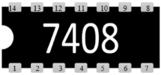
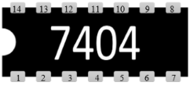
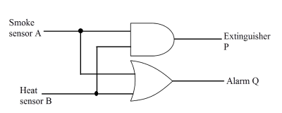
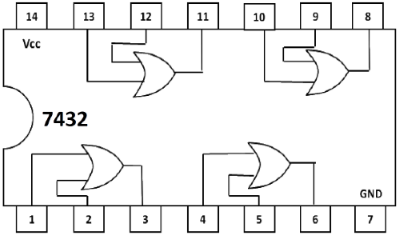
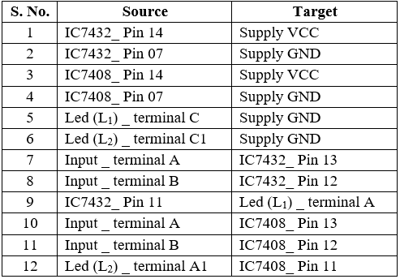
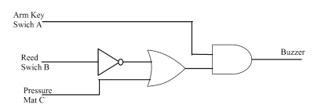
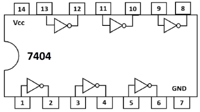
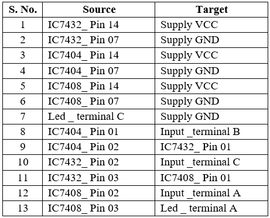

## Procedure 

### **A. Procedure for Fire Alarm Simulation**

**1.** Fill the truth table and click on check button.  
**2.** Click on the component button to place the component on the table.  

  
&emsp; &emsp; &emsp; &emsp;")&emsp; ") &emsp; &emsp; &emsp;   

**Fig. 1: Components** 

**3.** Make connections as per the circuit diagram and pic diagrams of ICs or connection table.

**Fig. 2: Circuit diagram of fire alarm using logic gate ICs.**

**Fig. 3: Pin diagram of IC-7408.**

**Fig. 4: Pin diagram of IC-7432.** 

**Table 1: Connection table for fire alarm simulation.**

**4.** Click on '**Check Connections**' button. If connections are right, the '**Start Simulation**' button will become active. Click on it to start simulation.  
**5.** Click on the toggle switches '**A**' and '**B**' to perform simulation.

### **B. Procedure for Burglar Alarm Simulation**

**1.** Fill the truth table and click on check button.  
**2.** Click on the component button to place the component on the table.  
**3.** Make connections as per the circuit diagram and pin diagram of the ICs or connection table.

  

**Fig. 5: Circuit diagram of burglar alarm using logic gate ICs.**

**Fig. 6: Pin diagram of IC-7408.**

**Fig. 7: Pin diagram of IC-7432.**

**Fig. 8: Pin diagram of IC-7404.**

**Table 2: Connection table for burglar alarm simulation.**

**4.** Click on '**Check Connections**' button. If connections are right, the '**Start Simulation**' button will become active. Click on it to start simulation.  
**5.** Click on the toggle switches '**A**', '**B**' and '**C**' to perform simulation.

